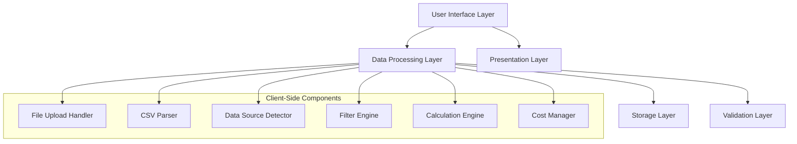

# Design Document

## Overview

The Financial Automation Portal is a client-side web application built with HTML5, JavaScript, and Tailwind CSS. The system processes CSV data from multiple financial platforms (Izipay, Culqi, Sirvoy) and provides comprehensive financial analysis capabilities. The architecture emphasizes simplicity, performance, and user experience with a single-page application approach.

## Architecture

### High-Level Architecture



### Technology Stack

- **Frontend Framework**: Vanilla JavaScript (ES6+)
- **Styling**: Tailwind CSS for responsive design
- **Data Processing**: Client-side CSV parsing and manipulation
- **Storage**: Browser localStorage for session persistence
- **File Handling**: HTML5 File API for CSV uploads

## Components and Interfaces

### 1. File Upload Component

**Purpose**: Handle multiple CSV file uploads and manual data entry

**Key Methods**:
- `handleFileUpload(files)`: Process multiple file uploads
- `handleManualInput(csvText)`: Process pasted CSV data
- `validateFileFormat(file)`: Ensure file is valid CSV

**Interface**:
```javascript
class FileUploadHandler {
    constructor(onDataProcessed) {
        this.onDataProcessed = onDataProcessed;
    }
    
    async handleFileUpload(files) {
        // Process multiple files simultaneously
    }
    
    async handleManualInput(csvText) {
        // Process pasted CSV data
    }
    
    validateFileFormat(file) {
        // Validate CSV format
    }
}
```

### 2. Data Source Detector

**Purpose**: Automatically identify data source (Izipay, Culqi, Sirvoy) based on CSV structure

**Detection Logic**:
- **Izipay**: Look for headers like "transaction_id", "amount", "status", "created_at"
- **Culqi**: Look for headers like "id", "amount_fee", "creation_date", "currency_code"
- **Sirvoy**: Look for headers like "booking_id", "total_amount", "check_in", "payment_status"

**Interface**:
```javascript
class DataSourceDetector {
    detectSource(headers) {
        // Return 'izipay', 'culqi', 'sirvoy', or 'unknown'
    }
    
    getParsingRules(source) {
        // Return source-specific parsing configuration
    }
}
```

### 3. CSV Parser

**Purpose**: Parse CSV data according to detected source format

**Key Features**:
- Source-specific field mapping
- Data type conversion (dates, amounts)
- Error handling for malformed data

**Interface**:
```javascript
class CSVParser {
    parse(csvText, source) {
        // Return array of transaction objects
    }
    
    mapFields(row, source) {
        // Map source-specific fields to standard format
    }
    
    validateRow(row, source) {
        // Validate individual row data
    }
}
```

### 4. Filter Engine

**Purpose**: Filter transactions by date range and source type

**Interface**:
```javascript
class FilterEngine {
    constructor(transactions) {
        this.transactions = transactions;
    }
    
    filterByDateRange(startDate, endDate) {
        // Return filtered transactions
    }
    
    filterBySource(sourceType) {
        // Return transactions from specific source
    }
    
    applyFilters(filters) {
        // Apply multiple filters simultaneously
    }
}
```

### 5. Calculation Engine

**Purpose**: Perform financial calculations and generate summaries

**Interface**:
```javascript
class CalculationEngine {
    calculateTotalsBySource(transactions) {
        // Return totals grouped by source
    }
    
    calculateOverallTotal(transactions) {
        // Return total across all sources
    }
    
    calculateNetProfit(totalIncome, totalCosts) {
        // Return net profit calculation
    }
}
```

### 6. Cost Manager

**Purpose**: Manage additional operational costs

**Interface**:
```javascript
class CostManager {
    constructor() {
        this.costs = [];
    }
    
    addCost(description, amount) {
        // Add new cost item
    }
    
    removeCost(id) {
        // Remove cost item
    }
    
    getTotalCosts() {
        // Return sum of all costs
    }
}
```

## Data Models

### Transaction Model

```javascript
class Transaction {
    constructor({
        id,
        source,           // 'izipay', 'culqi', 'sirvoy'
        amount,           // Numeric amount
        currency,         // Currency code
        date,             // Date object
        status,           // Transaction status
        description,      // Transaction description
        originalData      // Raw data from CSV
    }) {
        this.id = id;
        this.source = source;
        this.amount = parseFloat(amount);
        this.currency = currency || 'PEN';
        this.date = new Date(date);
        this.status = status;
        this.description = description;
        this.originalData = originalData;
    }
    
    isValid() {
        return this.amount > 0 && this.date instanceof Date && !isNaN(this.date);
    }
}
```

### Cost Model

```javascript
class Cost {
    constructor(description, amount) {
        this.id = Date.now() + Math.random();
        this.description = description;
        this.amount = parseFloat(amount);
        this.createdAt = new Date();
    }
    
    isValid() {
        return this.amount > 0 && this.description.trim().length > 0;
    }
}
```

### Financial Summary Model

```javascript
class FinancialSummary {
    constructor() {
        this.totalsBySource = {};
        this.overallTotal = 0;
        this.totalCosts = 0;
        this.netProfit = 0;
        this.transactionCount = 0;
    }
    
    update(transactions, costs) {
        // Recalculate all financial metrics
    }
}
```

## Error Handling

### File Upload Errors
- **Invalid file format**: Display user-friendly message with supported formats
- **File too large**: Implement size limits and provide feedback
- **Parsing errors**: Show specific line numbers and error details
- **Network issues**: Provide retry mechanisms for file processing

### Data Validation Errors
- **Invalid CSV structure**: Highlight problematic rows and columns
- **Missing required fields**: Specify which fields are missing
- **Invalid data types**: Show conversion errors with suggestions
- **Date format issues**: Provide examples of expected date formats

### Calculation Errors
- **Division by zero**: Handle edge cases in percentage calculations
- **Overflow errors**: Implement bounds checking for large numbers
- **Currency conversion**: Handle missing or invalid currency codes

### Error Display Strategy
- Use toast notifications for temporary errors
- Display inline validation messages for form errors
- Provide detailed error logs in a collapsible section
- Implement error recovery suggestions where possible

## Testing Strategy

### Unit Testing
- **CSV Parser**: Test with various CSV formats and edge cases
- **Data Source Detector**: Verify correct identification of all supported sources
- **Calculation Engine**: Test mathematical operations with boundary values
- **Filter Engine**: Validate filtering logic with complex date ranges
- **Cost Manager**: Test CRUD operations and validation

### Integration Testing
- **File Upload Flow**: Test complete upload-to-display workflow
- **Manual Input Flow**: Test paste-to-process functionality
- **Filter Application**: Test filter combinations and their effects on calculations
- **Data Persistence**: Test localStorage functionality across browser sessions

### User Interface Testing
- **Responsive Design**: Test on various screen sizes and devices
- **Accessibility**: Verify keyboard navigation and screen reader compatibility
- **Cross-browser Compatibility**: Test on Chrome, Firefox, Safari, and Edge
- **Performance**: Test with large CSV files and multiple simultaneous uploads

### Test Data Sets
- Create sample CSV files for each supported source (Izipay, Culqi, Sirvoy)
- Include edge cases: empty files, malformed data, special characters
- Test with various date formats and currency codes
- Create performance test files with 1000+ transactions

### Automated Testing Tools
- **Jest**: For unit testing JavaScript functions
- **Cypress**: For end-to-end user interface testing
- **Lighthouse**: For performance and accessibility auditing
- **ESLint**: For code quality and consistency checking

## Performance Considerations

### Client-Side Processing
- Implement chunked processing for large CSV files
- Use Web Workers for heavy parsing operations
- Implement progressive loading for better user experience
- Cache parsed data to avoid reprocessing

### Memory Management
- Clear unused data structures after processing
- Implement pagination for large transaction lists
- Use efficient data structures for filtering operations
- Monitor memory usage during file processing

### User Experience Optimizations
- Show progress indicators for long-running operations
- Implement debounced filtering to reduce unnecessary calculations
- Use virtual scrolling for large transaction lists
- Provide keyboard shortcuts for common operations